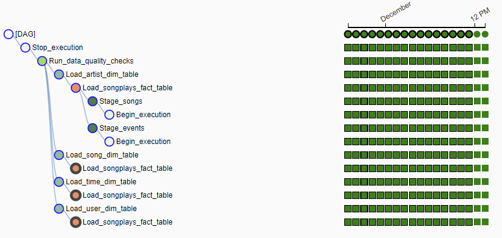
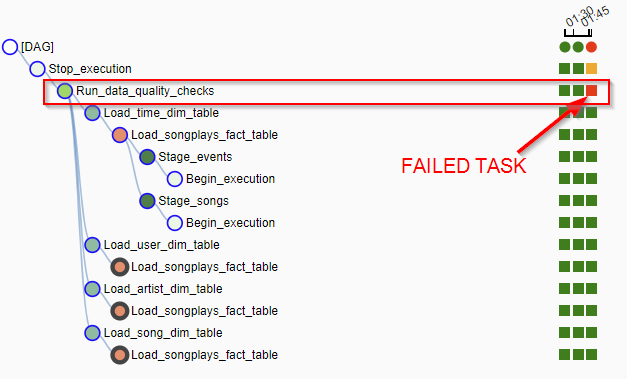
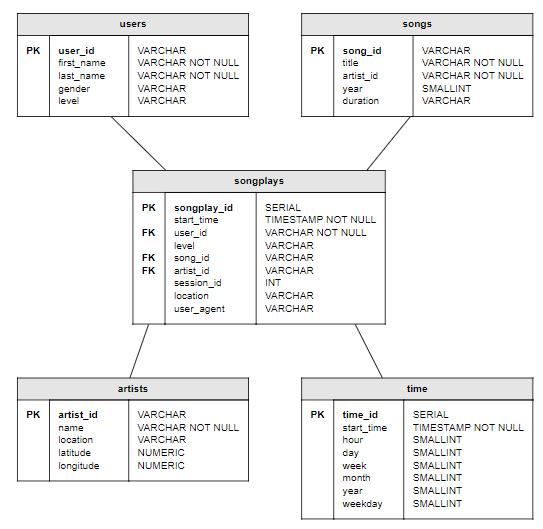

# Data Pipelinew with Airflow

## Overview

This program automates the Sparkify data pipelines to ETL big data from their S3 bucket to an Amazon Redshift cluster using Apache Airflow.  These actions are executed on an hourly interval, so that fact and dimension tables will always be up-to-date.

This program satifies requirements of the Udacity Data Engineering Nanodegree program for Data Pipelines Project #5.


## Prequisites

1. Make sure the raw data files are properly located in S3 bucket with path `s3://udacity-dend/`.
2. An Apache Airflow workspace.
3. An Amazon Redshift cluster
    1. Add rule allowing for inbound traffic. 
    2. Add tables ahead of time using the SQL statements found in the `create_tables.sql` file. This is a one-time operation (as long as the cluster persists).  Future versions of the Airflow script will trigger the auto-creation of these tables if they don't exist.


## How to run

1. Copy all files to the Udacity project workspace. 

2. To start Airflow in the Udacity project workspace, at the command prompt run `/opt/airflow/start.sh`.  Once the server is ready press launch the Airflow web UI.

3. In the Airflow web UI enter the following connections (under the Admin menu, then Connections then Create):
    1. AWS Credentials
        ```
        Conn Id = aws_credentials
        Conn Type = Amazon Web Services
        Login = <aws key>
        Password = <aws secret key>
        ```
    2. Redshift connection
        ```
        Conn Id = redshift
        Conn Type = Postgres
        Host = <redshift endpoint WITHOUT the port> (e.g. redshift-cluster.czvudspjlacj.us-west-2.redshift.amazonaws.com)
        Schema = <redshift db name>  (e.g. dev)
        Login = <redshift db user>  (e.g. awsuser)
        Password = <redshift db password>
        ```

4. In the Airflow web UI enable (i.e. un-pause) the project DAG 
Airflow should then start executing at the top of each hour. 


## Expected output is

- View the Airflow web UI to see the graph.  All tasks should be green.



- If any quality check fails, you will see it as red and downstream tasks will fail.




---

## Raw Data

Files must be stored in `s3://udacity-dend/` bucket.

### Song Files
- Must be located in `data/song_data` directory.  They can be optionally be organized in subfolders under that (e.g. data/song_data/A/B/C)
- Must be JSON formatted and contain at least the following keys: song_id, title, artist_id, year, duration, artist_id, artist_name, artist_location, artist_latitude, artist_longitude


### Log files
- Must be located in `data/log_data` directory.  They can be optionally be organized in subfolders under that (e.g. data/log_data/A/B/C).
- The `log_json_path.json` file must be located in the bucket root folder.
- Must be JSON formatted and contain at least the following keys: userId, firstName, lastName, gender, level, ts (timestamp in milliseconds), page, sessionId, location, userAgent, artist, song

---

## Database Schema

Tables are organized into a star schema with **songplays** as the fact table at the center and dimension tables **users, songs, artists,** and **time** surrounding that.

- **songplays**: records in log data associated with song plays i.e. records with page NextSong
    - songplay_id, start_time, user_id, level, song_id, artist_id, session_id, location, user_agent
- **songs**: songs in music database
    - song_id, title, artist_id, year, duration
- **artists**: artists in music database
    - artist_id, name, location, latitude, longitude
- **users**: users in the app
    - user_id, first_name, last_name, gender, level
- **time**: timestamps of records in **songplays** broken down into specific units
    - start_time, hour, day, week, month, year, weekday



---
## Airflow Design Notes

### Table constraints

- The airflow sequence creates the fact table _before_ the dimension table, whereas this is normally done the opposite way. This is due to foreign keys needing to exist prior to populating the fact table.  However [Redshift](https://docs.aws.amazon.com/redshift/latest/dg/t_Defining_constraints.html) does NOT enforce such contraints. While this airflow could certainly respect this order, we do the fact table first only to simplify the task dependencies and diagram (otherwise an extra dummy task would be needed.)

- To start Airflow in the Udacity project workspace, at the command prompt run `/opt/airflow/start.sh`.

- If errors getting Airflow workspace to run properly (e.g. `cannot import name 'StageToRedshiftOperator'`), try Refreshing the workspace, and/or removing the python cache folders `__pycache__` by using `py3clean .` from the workspace command line. Then relaunch Airflow.
